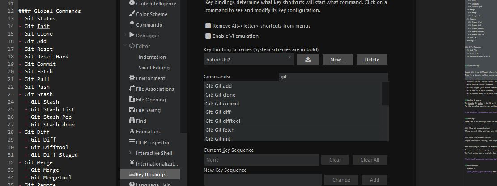
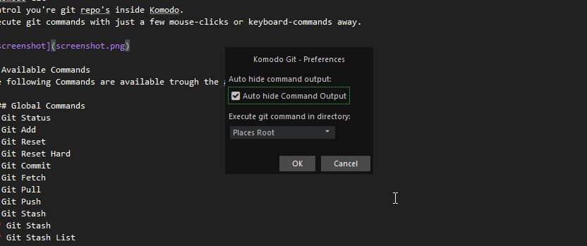

# Komodo Git
Control you're git repo's inside Komodo.  
Execute git commands with just a few mouse-clicks or keyboard-commands away.

## Available Commands
The following Commands are available trough the addon.

#### Global Commands
- Git Status
- Git Init
- Git Clone
- Git Add
- Git Reset
- Git Reset Hard
- Git Commit
- Git Fetch
- Git Pull
- Git Push
- Git Stash
  - Git Stash
  - Git Stash List
  - Git Stash Pop
  - Git Stash drop
- Git Diff
 - Git Diff
 - Git Difftool
 - Git Diff Staged
- Git Merge
 - Git Merge
 - Git Mergetool
- Git Remote
 - Git Remote List
 - Git Remote Add
 - Git Remote Remove
 - Git Remote Rename
 - Git Remote Set Url
- Git Run CMD
- Settings
 
#### File Commands
- Git Add File
- Git Diff File
- Git Revert Changes In File
  

## Accessibility

Komodo Git is on different places integrated in Komodo.  
There is a dynamic toolbar button added, also is Git available trough different menu's:

 * Dynamic Toolbar button (global commands)
 * Main toolbar (global commands)
 * Places widget (file based commands)
 * File tab (file based commands)
 * File context menu (file based commands)

## Keyboard access
The Komodo Git addon is build so it can completely be controlled using access-keys.  
For the ones how want to set up there custom key bindings, these can be set using **preferences > keybindings**.

## Settings
There are a few settings that can be configured:

#### Show git command output
If you uncheck this setting, only the git commands that need to show there output will trigger the output window.

#### Auto hide command output
If you check this setting, the output window will auto-hide after showing the command output.

#### Execute git commands in directory:
This can be set to the project directory root, or the current places root.  
The last option can be useful, when working with nested git repo's.

## Requirements
 - Komodo X
 - [Git](https://git-scm.com/) need to be installed
